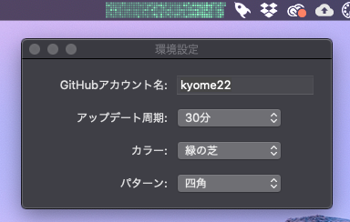
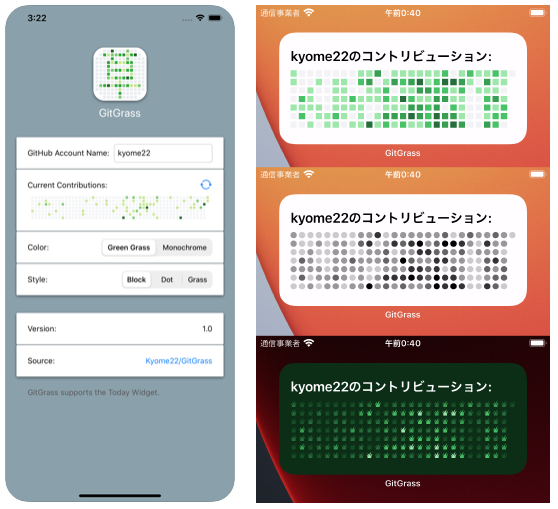

# GitGrass

<!-- # Short Description -->

GitHub Contributions Checker on the macOS menubar or iOS widget.

<!-- # Badges -->

# Tags

`GitHub` `Swift`

# Demo

## for macOS menubar

Download GitGrass for macOS → [App Store](https://apps.apple.com/us/app/gitgrass/id1501139279)

## for iOS widget

~~Download GitGrass for iOS → [App Store](https://apps.apple.com/us/app/gitgrass/id1503987405)~~

The official GitHub app has started offering the same features, so GitGrass for iOS has stopped delivering to the App Store.

# Contributors

- [Kyome22](https://github.com/Kyome22)

## Contributors ✨

Thanks goes to these wonderful people ([emoji key](https://allcontributors.org/docs/en/emoji-key)):

<!-- ALL-CONTRIBUTORS-LIST:START - Do not remove or modify this section -->
<!-- prettier-ignore-start -->
<!-- markdownlint-disable -->
<table>
  <tr>
    <td align="center"><a href="https://github.com/Kyome22"> <b>Kyome22</b></a> <a href="https://github.com/Kyome22/GitGrass/commits?author=Kyome22" title="Code">💻</a> <a href="https://github.com/Kyome22/GitGrass/commits?author=Kyome22" title="Documentation">📖</a> <a href="#question-Kyome22" title="Answering Questions">💬</a> <a href="https://github.com/Kyome22/GitGrass/issues?q=author%3AKyome22" title="Bug reports">🐛</a> <a href="#review-Kyome22" title="Reviewed Pull Requests">👀</a></td>
    <td align="center"><a href="https://github.com/lorant-csonka-planorama"> 
    <b>Lorant Csonka</b></a> <a href="https://github.com/Kyome22/GitGrass/commits?author=lorant-csonka" title="Code">💻</a><a href="https://github.com/Kyome22/GitGrass/commits?author=lorant-csonka" title="Documentation">📖</a>  </td> 
  </tr>
</table>

<!-- markdownlint-enable -->
<!-- prettier-ignore-end -->
<!-- ALL-CONTRIBUTORS-LIST:END -->

This project follows the [all-contributors](https://github.com/all-contributors/all-contributors) specification. Contributions of any kind welcome!

<!-- CREATED_BY_LEADYOU_README_GENERATOR -->
